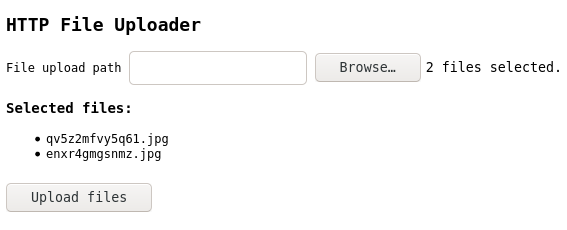

# elevate

`elevate` is a HTTP file upload server. Files are uploaded to the server's host file system.

```
$ ./elevate --help
Usage of ./elevate:
  -base_dir string
        Base directory for storing files. (default ".")
```



## Feature Set

- Upload multiple files to the server file system, over http, at once.
- Selected files are listed before uploading.
- Target directory in the server's host file system can be specified as shown above. Additionally, you can specify to which subdirectory you want to upload in the html form.
- Minimal page loading time. The entire web page is self contained in a single html file.
- Manages to be one of the most barebones file upload server that does exactly what it says.

## Build Instructions

Simply clone the repository and build with the go tool.

```
git clone https://github.com/arindas/elevate.git
cd elevate
go build
```

_As of now the binary requires the `web/` folder to be in the same directory._ This will change in the future with [go-embed](https://golang.org/pkg/embed/).